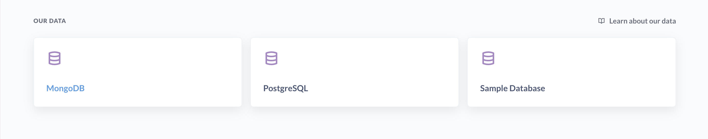
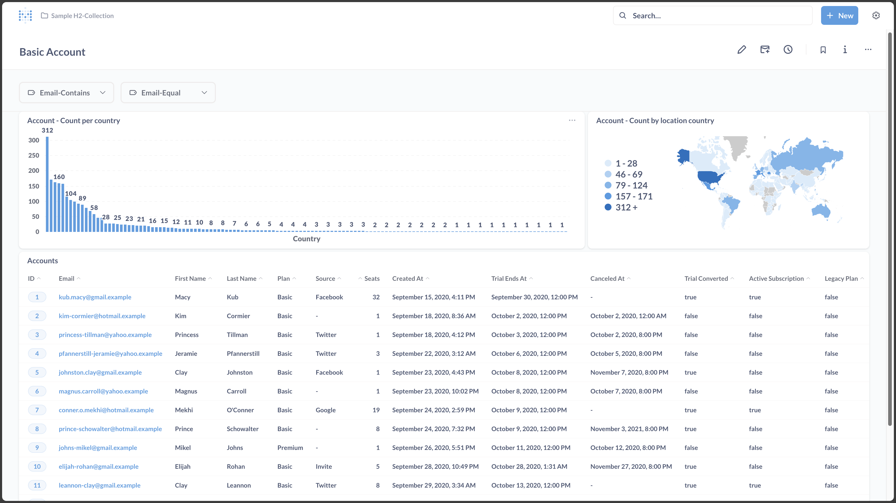
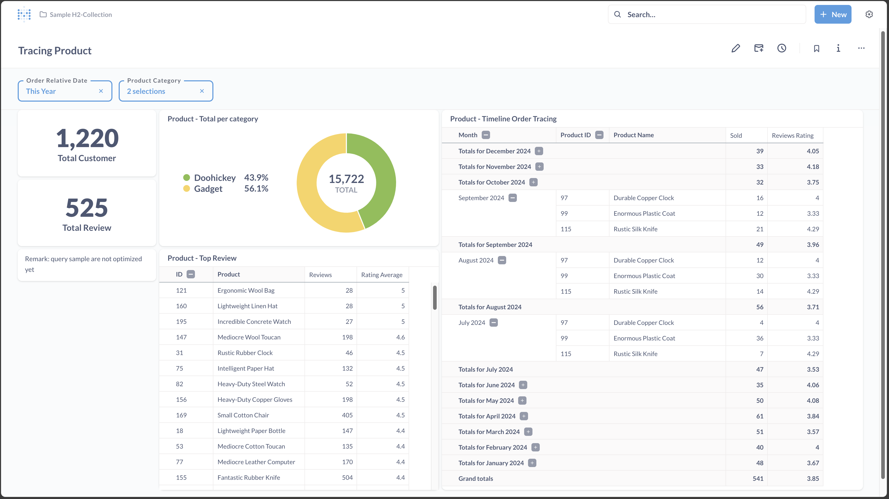

- ## Instructions
   - recommand `yarn` for node helper
   - run `docker-compose up/down` or `yarn up/down` to start containers at port `3000`
   - run `yarn clean` or `yarn clean-meta` or `yarn clean-db` to clean up local data

- ## Showcases
  - DB Connections 
     - docker setup
     - database connection 
  - Basic Dashboard 
  - Advance Dashboard 
     - overflow ui
     - data analysis
     - data timeline tracing

- ## Username/Password for sample
  - user: sample.metabase@gmail.com
  - pass: aBJ-fGlyEQk461
